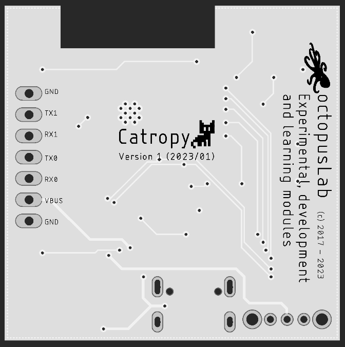
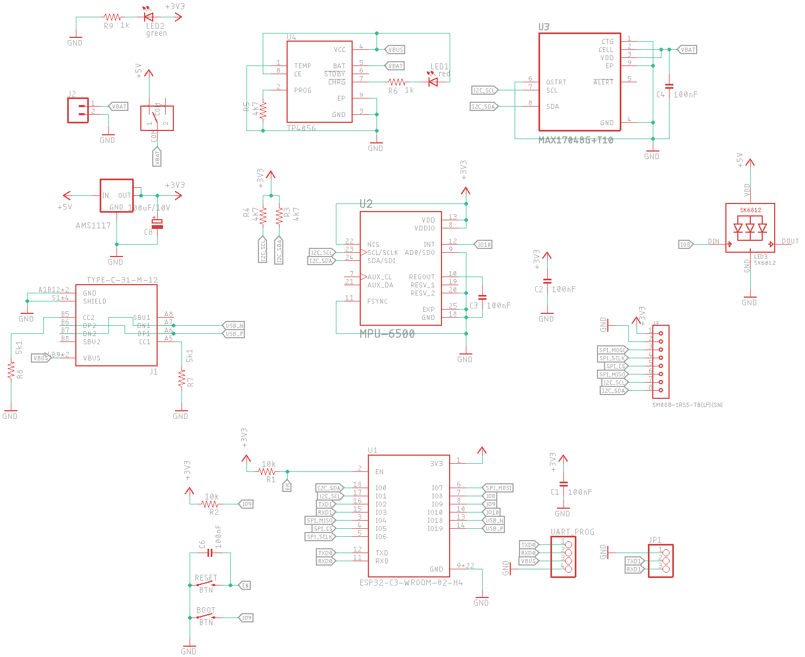

# Catropy docs

Catropy, originally proposed in the Proof-of-Cat [CatPaper](./proofofcat.pdf), is a small device dedicated to harvesting entropy from cats. 

## Design 

Heart of the device is a custom board which comes in a hand-made ball. Current design is a result of various iterations which improved effectivity and miniaturized the board. 

It consists of:

- ESP32 C3 microcontroller with wifi, Bluetooth
- Sensors for gathering data - gyroscope, accelerometer, thermometer
- 3 informational LEDs
- Lipo battery 500-800mAh and charging circuit 
- USBC for charging and programming the microcontroller 

Board scheme:

  




ESP microcontroller is flashed with MicroPython firmware and Catropy software is written in Python. It serves a simple API over local network to provide the created randomness. Current version can be [found here](https://github.com/taxmeifyoucan/proof-of-cat/tree/master/esp). 

Entropy is collected from 6 values (3 axis from gyro and accelerometer), then further randomized using chaos formula and hashed together. Parts of created hashes are combined to create a big string which is tested for lenght in bits and Shannon entropy. When it passes certain value, random data can be read from the device by simple http call. 

## Usage 

Guide for setting up the device and pulling entropy. To use it, it only needs to be setup once and it requires connecting board to your computer. 

### Controlling the device 

Device can be controlled using standard tools for ESP microcontrollers. The easiest approach would be a GUI IDE [Thonny](https://thonny.org). It's supported on all major operating systems, you can download and install like any other program. 

Or if you prefer, using pip:
```
pip3 install thonny
```

If you would rather use a terminal instead of IDE, there are other command tools installable with pip which can be helpful:

- `esptool` (flashing firmware)
- `adafruit-ampy` (copying, executing files)
- `picocom` (terminal REPL prompt)

After installing Thonny or other tool you prefer, connect the board using its USBC to the computer. When you open Thonny, you should see a Python shell connected to the device: 


#### Connection troubleshooting 

If you get an error and shell doesn't pops up, make sure Thonny recognizes the device. You can find the port used for communication with divces in `Tools > Options... > Interpreter (tab) > Port or WebREPL`. In case there is are no devices listed, make sure it is connected properly and other programs are not using it.

On Linux systems, make sure the user has correct rights to access the device: 
```
sudo chmod 666 /dev/ttyACM0  
```
or add your user to dialout group
```
sudo usermod -a -G dialout $USER
```

### Enabling WiFi

To use the device for creating and pulling randomness, first you have to have connect it to a local Wifi network. You can use your home network but for increased security, it is recommended to use a network without internet access, e.g. using mobile hotspot.  Other possible ways of pulling entropy (Bluetooth, serial) are currently not supported. 

We will start the device and connect to your WiFi using program stored in the device. 

Connect Catropy to your computer and start Thonny. You can browse files stored on the device using `File > Open... > Micropython Device`. Here you can see all files on the device and you can verify they match those in the repository. 

Open file `wifi_connect.py` and you will see its contents in Thonny interface. On the top, set variables to match your network. 

```
# WiFi name and passowrd
SSID = my_network_name
PASS= my_network_password
```

That's it! Now you can run the program by click green play button. Look into output in the bottom part of Thonny, it will look something like this: 

Note the IP address and save it. 

It also prints battery charge, consider charging the device before using it futher. 


### Charging

Fully charging the battery can take up to 2 hours. The expected battery life can reach 8 hours but device will never let battery to fully discharge. Before turning the device on, make sure it is charged enough. The red LED will be on until the device is fully charged or you can check the percentage by running `wifi_connect.py` from Thonny/terminal. 

### Collecting entropy

If device has WiFi network configured and battery charged, you are ready to embrace the chaos! 

Turn the device on using switch on the side and while RGB led is changing colors, it is collecting entropy. Put the device back to the ball and make sure it moves randomly :)  Random data are now generated from its movement. It can take around 10 minutes for the random data to reach neccessary size. When it happens, led changes. 

Now you can reach the devices via API on the local address. Use the local address which you saved during device setup and call it using `curl` or your browser. If the IP is not correct, it might changed during a reconnect and you can check it in your WiFi hotspot device. 

Calling the address directly will output the main random string. To check devices status, you can call `/status` path. 


